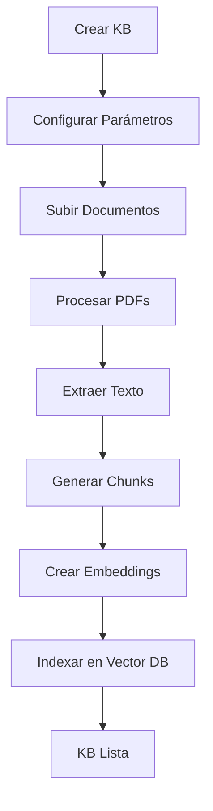
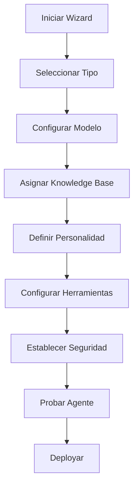
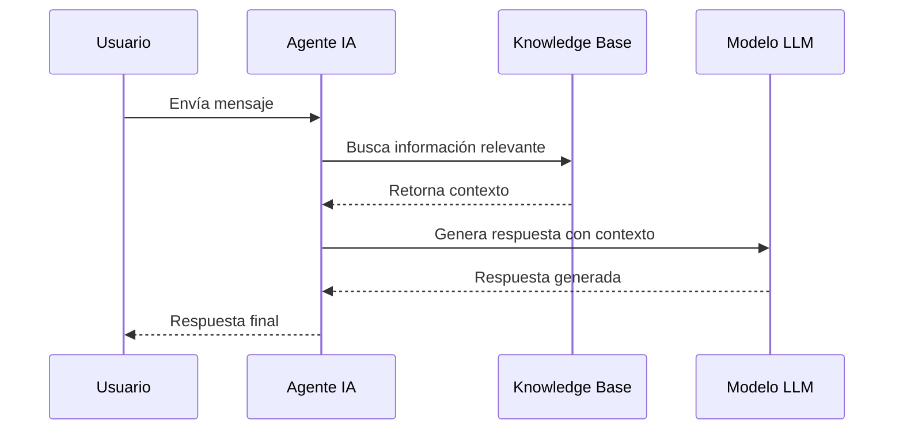

# Sistema de Knowledge Base Inteligente y Gestión de Agentes IA

## Resumen Ejecutivo

El sistema de Knowledge Base Inteligente de WazzApp Manager permite crear, gestionar y utilizar bases de conocimiento avanzadas para potenciar agentes de inteligencia artificial. Este sistema proporciona una plataforma completa para la gestión de documentos, procesamiento de PDFs, y creación de agentes IA especializados.

## Arquitectura del Sistema

### Componentes Principales

#### 1. Knowledge Base Engine
- **Gestión de Documentos**: Almacenamiento y indexación de documentos PDF, texto y multimedia
- **Procesamiento de IA**: Extracción automática de contenido y generación de embeddings
- **Búsqueda Semántica**: Búsqueda avanzada basada en similitud vectorial
- **Versionado**: Control de versiones de documentos y bases de conocimiento

#### 2. AI Agent Manager
- **Creación de Agentes**: Wizard intuitivo para configurar agentes especializados
- **Asignación de Knowledge Base**: Vinculación de bases de conocimiento específicas a agentes
- **Configuración de Modelos**: Soporte para GPT-4, Claude, y modelos personalizados
- **Gestión de Personalidad**: Definición de prompts de sistema y comportamiento

#### 3. Document Processing Pipeline
- **Extracción de PDF**: Procesamiento automático de archivos PDF
- **Análisis de Contenido**: Identificación de temas, entidades y conceptos clave
- **Chunking Inteligente**: División optimizada de documentos para mejor recuperación
- **Metadatos Automáticos**: Generación automática de metadatos descriptivos

## Funcionalidades Principales

### Knowledge Base Management

#### Creación y Configuración
```typescript
interface KnowledgeBase {
  id: string;
  name: string;
  description: string;
  documents: Document[];
  settings: {
    chunkSize: number;
    overlap: number;
    embeddingModel: string;
    indexType: 'semantic' | 'keyword' | 'hybrid';
  };
  metadata: {
    created: Date;
    updated: Date;
    version: string;
    documentsCount: number;
    totalSize: number;
  };
}
```

#### Gestión de Documentos
- **Subida de Archivos**: Soporte para PDF, DOCX, TXT, HTML
- **Procesamiento Automático**: Extracción y análisis del contenido
- **Validación de Calidad**: Verificación de integridad y relevancia
- **Organización**: Categorización automática y manual

#### Búsqueda y Recuperación
- **Búsqueda Semántica**: Consultas en lenguaje natural
- **Filtros Avanzados**: Por fecha, tipo, relevancia, categoría
- **Ranking de Resultados**: Puntuación de relevancia y confianza
- **Contexto Preservado**: Mantenimiento del contexto original

### AI Agent Creation

#### Tipos de Agentes Disponibles

##### 1. Agente Conversacional
- **Propósito**: Interacciones naturales y fluidas
- **Características**:
  - Memoria de conversación
  - Personalidad configurable
  - Respuestas contextuales
  - Manejo de múltiples idiomas

##### 2. Agente con Herramientas (Tool-Using)
- **Propósito**: Ejecución de tareas específicas
- **Herramientas Integradas**:
  - Búsqueda web
  - Consultas a base de datos
  - APIs externas
  - Calculadora
  - Procesamiento de archivos

##### 3. Agente de Razonamiento
- **Propósito**: Análisis complejo y toma de decisiones
- **Características**:
  - Pensamiento paso a paso
  - Evaluación de opciones
  - Justificación de respuestas
  - Manejo de incertidumbre

##### 4. Agente de Flujo de Trabajo
- **Propósito**: Automatización de procesos complejos
- **Características**:
  - Integración con LangGraph
  - Flujos condicionales
  - Paralelización de tareas
  - Manejo de errores

##### 5. Sistema Multi-Agente
- **Propósito**: Colaboración entre múltiples agentes especializados
- **Características**:
  - Coordinación automática
  - Especialización por dominio
  - Comunicación inter-agente
  - Escalabilidad horizontal

#### Configuración de Agentes

```typescript
interface AIAgentConfiguration {
  // Configuración Básica
  name: string;
  type: AgentType;
  description: string;
  
  // Modelo de IA
  model: {
    provider: 'openai' | 'anthropic' | 'custom';
    modelName: string;
    temperature: number;
    maxTokens: number;
  };
  
  // Knowledge Base
  knowledgeBases: string[];
  searchSettings: {
    maxResults: number;
    relevanceThreshold: number;
    contextWindow: number;
  };
  
  // Personalidad y Comportamiento
  systemPrompt: string;
  personality: {
    tone: 'professional' | 'friendly' | 'casual' | 'formal';
    style: 'concise' | 'detailed' | 'conversational';
    expertise: string[];
  };
  
  // Herramientas y Capacidades
  tools: ToolConfiguration[];
  capabilities: {
    fileProcessing: boolean;
    webSearch: boolean;
    calculations: boolean;
    dataAnalysis: boolean;
  };
  
  // Configuración de Seguridad
  security: {
    contentFilter: boolean;
    allowedDomains: string[];
    rateLimit: number;
    dataRetention: number;
  };
}
```

## Implementación Técnica

### Stack Tecnológico

#### Frontend
- **React 18** con TypeScript
- **React Flow** para editor visual de flujos
- **Tailwind CSS** + Shadcn/UI para interfaz
- **Zustand** para gestión de estado global

#### Backend Services
- **Node.js** con Express/Fastify
- **Vector Database** (Pinecone/Chroma/Qdrant)
- **Document Processing** (LangChain/LlamaIndex)
- **AI Models** (OpenAI, Anthropic, local models)

#### Storage y Data
- **PostgreSQL** para metadatos y configuraciones
- **S3/MinIO** para almacenamiento de documentos
- **Redis** para caché y sesiones

### APIs y Endpoints

#### Knowledge Base API
```typescript
// Crear Knowledge Base
POST /api/knowledge-base
{
  name: string;
  description: string;
  settings: KnowledgeBaseSettings;
}

// Subir Documento
POST /api/knowledge-base/{id}/documents
Content-Type: multipart/form-data
{
  file: File;
  metadata: DocumentMetadata;
}

// Buscar en Knowledge Base
POST /api/knowledge-base/{id}/search
{
  query: string;
  filters: SearchFilters;
  maxResults: number;
}
```

#### AI Agent API
```typescript
// Crear Agente
POST /api/agents
{
  configuration: AIAgentConfiguration;
}

// Interactuar con Agente
POST /api/agents/{id}/chat
{
  message: string;
  context: ConversationContext;
}

// Actualizar Configuración
PUT /api/agents/{id}/configuration
{
  updates: Partial<AIAgentConfiguration>;
}
```

## Flujo de Trabajo

### 1. Creación de Knowledge Base



### 2. Creación de Agente IA



### 3. Interacción con Usuario



## Componentes de UI Existentes

### Nodos de Flow Builder

#### AIAgentNode
- **Ubicación**: `src/components/FlowBuilder/nodes/AIAgentNode.tsx`
- **Funcionalidad**: Configuración completa de agentes IA
- **Características**:
  - 5 tipos de agentes diferentes
  - Configuración de herramientas
  - Gestión de memoria
  - Integración LangGraph
  - Sistema multi-agente

#### SmartonNode
- **Ubicación**: `src/components/FlowBuilder/nodes/SmartonNode.tsx`
- **Funcionalidad**: Nodo inteligente con knowledge base básico
- **Características**:
  - Integración con knowledge base
  - Tipos: genérico, catálogo, guardado de campos
  - Configuración de prompts
  - Intenciones de salida

#### AIResponseNode
- **Ubicación**: `src/components/FlowBuilder/nodes/AIResponseNode.tsx`
- **Funcionalidad**: Visualización de respuestas IA
- **Características**:
  - Configuración de modelo
  - Variables de contexto
  - Streaming de respuestas

## Próximos Desarrollos

### Módulo de Gestión de Agentes IA
Se desarrollará un módulo completo que incluirá:

1. **Dashboard de Agentes**
   - Lista de agentes creados
   - Métricas de rendimiento
   - Estado y salud de agentes

2. **Editor de Knowledge Base**
   - Interfaz para gestión de documentos
   - Visualización de contenido indexado
   - Herramientas de análisis

3. **Analytics y Monitoreo**
   - Métricas de uso
   - Análisis de conversaciones
   - Optimización de rendimiento

4. **Integración con HubSpot**
   - Sincronización de datos
   - Gestión de contactos
   - Flujos automatizados

## Consideraciones de Seguridad

### Protección de Datos
- Encriptación en tránsito y reposo
- Control de acceso basado en roles
- Auditoría de actividades
- Cumplimiento con GDPR/CCPA

### Filtrado de Contenido
- Detección de contenido sensible
- Moderación automática
- Configuración de políticas personalizadas

### Rate Limiting
- Límites por usuario/API key
- Prevención de abuse
- Escalado automático

## Roadmap de Implementación

### Fase 1: Foundation (Semanas 1-2)
- [ ] Módulo base de Knowledge Base
- [ ] Sistema de upload de PDFs
- [ ] Procesamiento básico de documentos

### Fase 2: Core Features (Semanas 3-4)
- [ ] Editor de agentes IA
- [ ] Integración con modelos LLM
- [ ] Dashboard de gestión

### Fase 3: Advanced Features (Semanas 5-6)
- [ ] Búsqueda semántica avanzada
- [ ] Sistema multi-agente
- [ ] Analytics y métricas

### Fase 4: Integration (Semanas 7-8)
- [ ] Integración con HubSpot
- [ ] APIs públicas
- [ ] Documentación completa

## Conclusión

El sistema de Knowledge Base Inteligente representa una evolución significativa en la gestión de información y automatización de respuestas. La combinación de procesamiento avanzado de documentos, agentes IA especializados y una interfaz intuitiva proporciona una plataforma poderosa para transformar la manera en que las organizaciones gestionan el conocimiento y la atención al cliente.