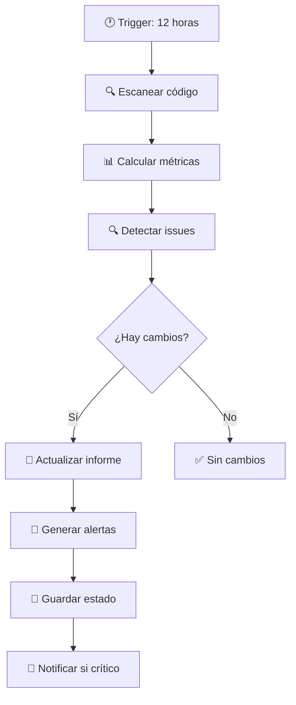

# 🔍 SISTEMA DE MONITOREO AUTOMATIZADO

**Sistema inteligente de revisión de código que ejecuta cada 12 horas para mantener la calidad y detectar problemas automáticamente.**

---

## 🎯 **¿QUÉ HACE ESTE SISTEMA?**

El sistema de monitoreo automatizado es tu **asistente de código 24/7** que:

✅ **Detecta cambios** en tiempo real  
✅ **Analiza calidad** del código automáticamente  
✅ **Identifica problemas** críticos y vulnerabilidades  
✅ **Actualiza documentación** de revisión  
✅ **Genera alertas** para acción inmediata  
✅ **Mantiene historial** de evolución del código  

---

## 🚀 **INSTALACIÓN RÁPIDA**

### **Paso 1: Configuración Automática**
```bash
# Ejecutar script de setup (recomendado)
bash scripts/setup-monitoring.sh
```

### **Paso 2: Verificar Instalación**
```bash
# Ejecutar monitoreo una vez para probar
npm run monitor:run
```

### **Paso 3: ¡Listo!**
El sistema ahora ejecutará automáticamente cada 12 horas.

---

## 📘 **COMANDOS DISPONIBLES**

### **🔍 Monitoreo**
```bash
npm run monitor:run          # Ejecutar análisis una vez
npm run monitor:start        # Ejecutar continuamente (modo desarrollo)
npm run monitor:logs         # Ver logs en tiempo real
npm run monitor:setup        # Reconfigurar sistema
```

### **📊 Utilidades**
```bash
# Ver estado actual
cat .code-tracking.json | jq '.'

# Ver último log
tail -f logs/monitoring_*.log

# Ver alertas críticas
cat ALERTAS_CODIGO.md
```

---

## 📁 **ARCHIVOS GENERADOS**

| Archivo | Descripción | Actualización |
|---------|------------|---------------|
| `📄 REVISION_COMPLETA_APLICACION.md` | Informe principal con análisis detallado | Cada 12h |
| `🚨 ALERTAS_CODIGO.md` | Alertas críticas que requieren atención | Cada 12h |
| `📈 .code-tracking.json` | Estado interno del sistema (no editar) | Cada 12h |
| `📋 logs/monitoring_*.log` | Logs de ejecución con timestamps | Cada 12h |

---

## 🔧 **CONFIGURACIÓN AVANZADA**

### **Archivo de Configuración: `.monitoring-config.json`**
```json
{
  "enabled": true,
  "interval": "12h",
  "patterns": {
    "critical": ["TODO", "FIXME", "HACK", "BUG", "XXX"],
    "security": ["innerHTML", "eval(", "document.write"],
    "quality": ["any;", ": any", "console.log"]
  },
  "thresholds": {
    "newTodos": 5,        // Alertar si más de 5 TODOs nuevos
    "newAnyTypes": 10,    // Alertar si más de 10 tipos 'any' nuevos
    "fileLines": 1000     // Alertar si archivo > 1000 líneas
  }
}
```

### **Personalizar Patrones de Detección**
```javascript
// Editar scripts/monitor-changes.js línea ~25
this.criticalPatterns = [
  /TODO|FIXME|HACK|BUG|XXX/gi,          // TODOs y problemas
  /console\.log|console\.warn/gi,       // Console logs
  /any\s*;|:\s*any/gi,                  // Tipos any
  /\.innerHTML\s*=/gi,                  // Vulnerabilidades XSS
  /eval\(/gi,                           // Código eval
  /document\.write/gi,                  // Manipulación DOM insegura
  
  // 🔧 Agregar tus propios patrones aquí:
  /password|secret|key/gi,              // Secrets en código
  /http:\/\//gi,                        // URLs no seguras
];
```

---

## 📊 **INTEGRACIÓN CON GITHUB ACTIONS**

### **Ejecución Automática en CI/CD**
El sistema incluye workflow de GitHub Actions que:

- ✅ **Se ejecuta cada 12 horas** automáticamente
- ✅ **Detecta cambios en push** a main/master  
- ✅ **Comenta en Pull Requests** con análisis
- ✅ **Crea issues automáticos** para alertas críticas
- ✅ **Cierra issues resueltos** automáticamente

### **Workflow: `.github/workflows/code-monitoring.yml`**
```yaml
# Triggers
on:
  schedule:
    - cron: '0 */12 * * *'  # Cada 12 horas
  workflow_dispatch:        # Ejecución manual
  push:
    branches: [ main ]      # En cada push
```

---

## 🚨 **SISTEMA DE ALERTAS**

### **Niveles de Alerta**

#### **🔴 CRÍTICO** - Acción Inmediata Requerida
- Vulnerabilidades de seguridad
- Código malicioso detectado
- Exposición de secrets/passwords

#### **🟡 ADVERTENCIA** - Programar Refactoring
- Muchos TODOs acumulados (>5)
- Degradación de type safety (>10 tipos `any`)
- Archivos muy largos (>1000 líneas)

#### **🔵 MEJORA** - Optimización Sugerida
- Oportunidades de refactoring
- Mejoras de performance
- Cleanup de código

### **Ejemplo de Alerta Crítica**
```markdown
# 🚨 ALERTAS DE CÓDIGO

## 🔴 ALERTAS CRÍTICAS (2)

### Vulnerabilidades de seguridad detectadas
**Elementos detectados**: 2

- 📍 `src/components/UserForm.tsx:45`
- 📍 `src/utils/sanitizer.ts:23`

**⚡ ACCIÓN REQUERIDA**: Revisar inmediatamente
```

---

## 📈 **MÉTRICAS Y ANÁLISIS**

### **Métricas Tracked**
- **Líneas de código** totales y por archivo
- **Número de archivos** por categoría (components, services, types)
- **Problemas detectados** por tipo y severidad
- **Tendencias** de calidad en el tiempo
- **Velocidad de resolución** de problemas

### **Dashboard de Métricas**
```bash
# Ver métricas actuales
node -e "
const fs = require('fs');
const state = JSON.parse(fs.readFileSync('.code-tracking.json', 'utf8'));
console.log('📊 MÉTRICAS ACTUALES:');
console.log('📄 Archivos:', state.metrics.totalFiles);
console.log('📝 Líneas:', state.metrics.totalLines);
console.log('🚨 Issues:', Object.values(state.issues).flat().length);
"
```

---

## 🔄 **FLUJO DE TRABAJO**

### **Ciclo Automático (Cada 12 Horas)**


### **Integración con Desarrollo**
1. **Desarrollador hace cambios** → commit & push
2. **GitHub Actions detecta** → ejecuta monitoreo
3. **Sistema analiza cambios** → genera informe
4. **Actualiza documentación** → commit automático
5. **Crea alertas si necesario** → issue en GitHub

---

## 🛠️ **TROUBLESHOOTING**

### **Problemas Comunes**

#### **❌ "Script no encontrado"**
```bash
# Verificar que existe el script
ls -la scripts/monitor-changes.js

# Reinstalar si es necesario
bash scripts/setup-monitoring.sh
```

#### **❌ "Permisos denegados"**
```bash
# Dar permisos de ejecución
chmod +x scripts/monitor-changes.js
chmod +x scripts/run-monitoring.sh
```

#### **❌ "Cron job no ejecuta"**
```bash
# Verificar cron jobs
crontab -l

# Ver logs de cron
grep CRON /var/log/syslog | tail -10

# Reconfigurar cron
bash scripts/setup-monitoring.sh
```

#### **❌ "Node.js no encontrado en cron"**
```bash
# Agregar PATH completo al cron job
which node  # Ver ruta de node

# Editar crontab
crontab -e
# Cambiar:
# 0 */12 * * * cd /path/to/project && bash scripts/run-monitoring.sh
# Por:
# 0 */12 * * * PATH=/usr/local/bin:$PATH cd /path/to/project && bash scripts/run-monitoring.sh
```

### **Logs de Debugging**
```bash
# Ver último log completo
ls -la logs/
tail -50 logs/monitoring_*.log

# Ejecutar con debug verbose
DEBUG=1 node scripts/monitor-changes.js

# Ver errores específicos
grep -i error logs/monitoring_*.log
```

---

## 📞 **SOPORTE Y MANTENIMIENTO**

### **Actualizaciones del Sistema**
```bash
# Actualizar a la última versión
git pull origin main
bash scripts/setup-monitoring.sh

# Verificar que funciona
npm run monitor:run
```

### **Limpiar Logs Antiguos**
```bash
# Limpiar logs > 30 días (automático en cada ejecución)
find logs -name "monitoring_*.log" -mtime +30 -delete

# Limpiar manualmente
rm logs/monitoring_*.log
```

### **Reset Completo**
```bash
# Limpiar todo el estado
rm .code-tracking.json
rm ALERTAS_CODIGO.md
rm -rf logs/

# Reconfigurar desde cero
bash scripts/setup-monitoring.sh
```

---

## 🎯 **ROADMAP**

### **v2.0 - Próximas Funcionalidades**
- [ ] **Dashboard web** interactivo
- [ ] **Integración Slack/Teams** para notificaciones
- [ ] **Métricas avanzadas** de complejidad ciclomática
- [ ] **Análisis de dependencies** y vulnerabilidades
- [ ] **Sugerencias automáticas** de refactoring
- [ ] **Comparación con proyectos** similares

### **v2.1 - Integraciones**
- [ ] **SonarQube** integration
- [ ] **ESLint/Prettier** auto-fix
- [ ] **Jest coverage** tracking
- [ ] **Performance budgets** monitoring

---

## 💡 **TIPS PRO**

### **Optimizar Performance**
```javascript
// Excluir directorios pesados del análisis
// Editar scripts/monitor-changes.js línea ~90
const skipDirs = [
  'node_modules', '.git', 'dist', 'build', '.next',
  'coverage', '.vscode', '.idea'  // ← Agregar más aquí
];
```

### **Alertas Personalizadas**
```javascript
// Crear alertas custom en generateAlerts()
if (changes.modifiedFiles.some(f => f.file.includes('config'))) {
  alerts.push({
    level: 'ADVERTENCIA',
    title: 'Configuración modificada',
    message: 'Verificar cambios en archivos de configuración'
  });
}
```

### **Integración con IDEs**
```bash
# VS Code: Agregar task.json
{
  "version": "2.0.0",
  "tasks": [
    {
      "label": "Monitor Code",
      "type": "shell",
      "command": "npm run monitor:run",
      "group": "build"
    }
  ]
}
```

---

## 🏆 **MEJORES PRÁCTICAS**

### **Para el Equipo**
1. **Revisar alertas diariamente** - No dejar acumular problemas
2. **Resolver críticos inmediatamente** - Prioridad máxima
3. **Documentar decisiones** - Actualizar ADRs
4. **Monitorear tendencias** - Buscar patrones en problemas

### **Para Nuevos Desarrolladores**
1. **Leer informe de revisión** antes de empezar
2. **Ejecutar `npm run monitor:run`** antes de commit
3. **Verificar que no hay alertas** nuevas
4. **Mantener archivos <500 líneas** cuando sea posible

---

**🎉 ¡Disfruta de un código siempre saludable con monitoreo automatizado!**

---

*📝 Este sistema fue diseñado para mantener la excelencia en el código sin interrumpir tu flujo de desarrollo. ¿Preguntas? ¿Sugerencias? ¡Abre un issue!*