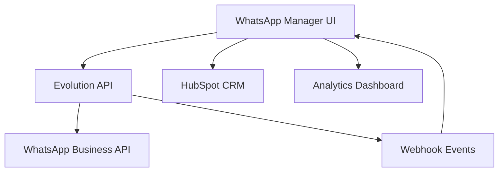

# WhatsApp Manager UI Kit

<div align="center">


Una aplicación React completa que funciona como interfaz frontend moderna para **Evolution API**, proporcionando gestión profesional de WhatsApp Business.

[🚀 Demo](https://your-demo-url.com) • [📖 Documentación](./docs/) • [🐛 Reportar Bug](https://github.com/Samuelbf2001/wazzap-manager-ui-kit/issues) • [💡 Solicitar Función](https://github.com/Samuelbf2001/wazzap-manager-ui-kit/issues)

</div>

## ✨ Características Principales

<table>
<tr>
<td>

### 📱 **Gestión WhatsApp**
- ✅ Múltiples instancias
- ✅ Envío multimedia completo
- ✅ Gestión de chats y grupos
- ✅ Monitoreo en tiempo real

</td>
<td>

### 🎯 **Funcionalidades Avanzadas**
- ✅ Flow Builder visual
- ✅ Integración HubSpot CRM
- ✅ Live Inbox tiempo real
- ✅ Analytics detallados

</td>
</tr>
</table>

## 🏗️ Arquitectura del Sistema



## 🚀 Instalación Rápida

### Prerrequisitos

- **Node.js** 18+ ([Descargar](https://nodejs.org/))
- **Evolution API** configurado ([Guía](./docs/EVOLUTION_API_INTEGRATION.md))
- **npm** o **yarn**

### 1️⃣ Clonar e Instalar

```bash
git clone https://github.com/Samuelbf2001/wazzap-manager-ui-kit.git
cd wazzap-manager-ui-kit
npm install
```

### 2️⃣ Configurar Variables

```bash
cp .env.example .env
```

Edita `.env` con tu configuración:

```env
# Evolution API
VITE_EVOLUTION_API_URL=http://localhost:8080
VITE_EVOLUTION_API_KEY=tu-api-key-aqui

# HubSpot (opcional)
VITE_HUBSPOT_API_KEY=tu-hubspot-key
VITE_HUBSPOT_PORTAL_ID=tu-portal-id
```

### 3️⃣ Ejecutar

```bash
# Desarrollo
npm run dev

# Producción
npm run build
npm run preview
```

🎉 **¡Listo!** Accede a `http://localhost:5173`

## 📚 Documentación

| Tema | Descripción | Enlace |
|------|-------------|--------|
| 🔌 **Integración Evolution API** | Configuración completa de Evolution API | [Ver docs](./docs/EVOLUTION_API_INTEGRATION.md) |
| 🏢 **HubSpot OAuth** | Configuración de integración HubSpot | [Ver docs](./docs/CONFIGURACION_HUBSPOT_OAUTH.md) |
| 🤖 **Agentes IA** | Sistema de agentes inteligentes | [Ver docs](./docs/DOCUMENTACION_KNOWLEDGE_BASE_IA.md) |
| 📊 **Analytics** | Métricas y reportes | [Ver docs](./docs/SISTEMA_REPORTE_MEJORAS_IA.md) |
| 🏗️ **Arquitectura** | Diseño del sistema | [Ver docs](./docs/ARQUITECTURA_INTEGRACION.md) |

## 🎯 Uso Principal

### Panel de Control Evolution API

Accede a `/dashboard/conexiones` para:

- **Gestión de Instancias**: Crear, conectar y monitorear
- **Envío de Mensajes**: Texto, multimedia, ubicaciones, encuestas
- **Live Inbox**: Conversaciones en tiempo real
- **Analytics**: Métricas detalladas

### Integración con Código

```typescript
import { evolutionAPIService } from './services/evolution-api.service';
import { useInstances, useMessages } from './hooks/use-evolution-api';

const MyComponent = () => {
  const { instances, createInstance } = useInstances();
  const { sendTextMessage } = useMessages('mi-instancia');
  
  // Crear instancia
  const handleCreateInstance = async () => {
    await createInstance({
      instanceName: 'nueva-instancia',
      qrcode: true,
      webhook: 'http://localhost:3000/webhook'
    });
  };
  
  // Enviar mensaje
  const handleSendMessage = async () => {
    await sendTextMessage({
      number: '5511999999999',
      text: '¡Hola desde WhatsApp Manager!'
    });
  };
};
```

## 🛠️ Stack Tecnológico

- **Frontend**: React 18 + TypeScript + Vite
- **UI**: Tailwind CSS + Shadcn/ui + Radix UI
- **Estado**: React Query + Context API
- **Ruteo**: React Router DOM
- **Formularios**: React Hook Form + Zod
- **Integraciones**: Evolution API, HubSpot, Typebot

## 🔧 Scripts Disponibles

```bash
npm run dev        # Servidor de desarrollo
npm run build      # Build de producción
npm run build:dev  # Build de desarrollo
npm run preview    # Preview del build
npm run lint       # Linter ESLint
```

## 🤝 Contribuir

¡Las contribuciones son bienvenidas! Por favor lee nuestra [Guía de Contribución](./CONTRIBUTING.md).

1. Fork el proyecto
2. Crea tu feature branch (`git checkout -b feature/AmazingFeature`)
3. Commit tus cambios (`git commit -m 'Add some AmazingFeature'`)
4. Push a la branch (`git push origin feature/AmazingFeature`)
5. Abre un Pull Request

## 📄 Licencia

Este proyecto está bajo la licencia MIT. Ver [`LICENSE`](LICENSE) para más detalles.

## 🆘 Soporte y Comunidad

- 💬 **Discord**: [Únete a nuestra comunidad](https://discord.gg/your-invite)
- 📧 **Email**: soporte@whatsappmanager.com
- 🐛 **Issues**: [GitHub Issues](https://github.com/Samuelbf2001/wazzap-manager-ui-kit/issues)

## 🌟 Roadmap

- [ ] Dashboard de Analytics avanzado
- [ ] Integración con más CRMs (Salesforce, Pipedrive)
- [ ] Automatizaciones avanzadas con IA
- [ ] Plantillas de mensajes predefinidas
- [ ] API pública para desarrolladores
- [ ] Aplicación móvil

## 🙏 Reconocimientos

- [Evolution API](https://github.com/EvolutionAPI/evolution-api) - Motor principal de WhatsApp
- [Shadcn/ui](https://ui.shadcn.com/) - Componentes UI
- [Radix UI](https://www.radix-ui.com/) - Primitivos UI accesibles

---

<div align="center">

**¡Construido con ❤️ para hacer WhatsApp Business más poderoso!**

[⭐ Star este repo](https://github.com/Samuelbf2001/wazzap-manager-ui-kit) | [🐛 Reportar Issues](https://github.com/Samuelbf2001/wazzap-manager-ui-kit/issues) | [💡 Solicitar Features](https://github.com/Samuelbf2001/wazzap-manager-ui-kit/issues)

</div>