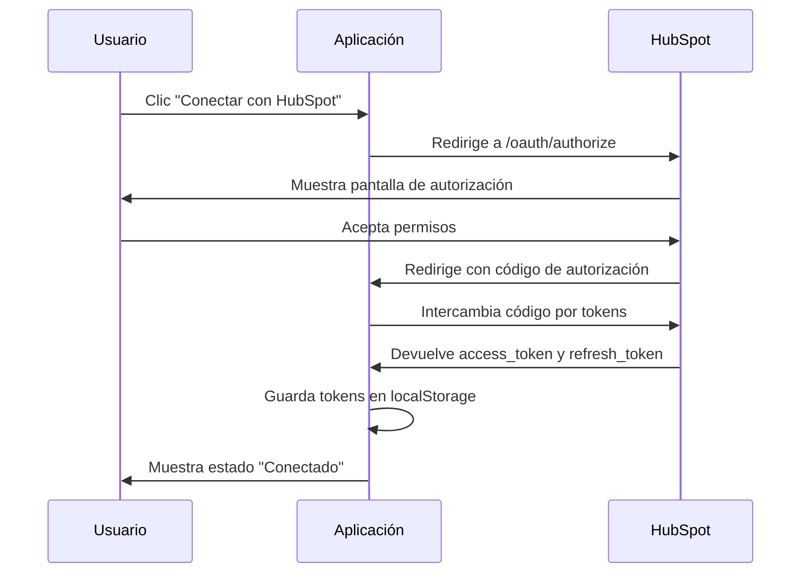

# Configuración de OAuth 2.0 con HubSpot

## Resumen

Tu integración con HubSpot ahora está completamente preparada para usar OAuth 2.0, que es más seguro y recomendado que las API Keys tradicionales.

## ✅ Lo que ya está implementado

### 1. Servicio OAuth (`src/services/hubspot-oauth.service.ts`)
- ✅ Generación de URL de autorización
- ✅ Intercambio de código por tokens
- ✅ Refresh automático de tokens
- ✅ Almacenamiento seguro en localStorage
- ✅ Revocación de tokens
- ✅ Manejo de errores y expiración

### 2. Servicio HubSpot actualizado (`src/services/hubspot.service.ts`)
- ✅ Soporte para OAuth 2.0 y API Key (compatibilidad)
- ✅ Obtención automática de tokens válidos
- ✅ Manejo de errores de autenticación
- ✅ Métodos para todas las operaciones CRM

### 3. Interfaz de usuario (`src/components/HubSpotIntegration.tsx`)
- ✅ Modal de configuración con opciones OAuth/API Key
- ✅ Flujo completo de autenticación OAuth
- ✅ Manejo del callback de autorización
- ✅ Estados visuales de conexión
- ✅ Desconexión segura

### 4. Extensión HubSpot (`src/hubspot-extension/`)
- ✅ Ya configurada para OAuth 2.0
- ✅ Configuración correcta de scopes
- ✅ Endpoints para webhooks y acciones

## 🔧 Pasos para configurar OAuth 2.0

### Paso 1: Crear aplicación en HubSpot

1. Ve al [HubSpot Developer Portal](https://developers.hubspot.com/)
2. Crea una nueva aplicación o selecciona una existente
3. En la sección "Auth", configura:
   - **Redirect URL**: `http://localhost:3000/hubspot/callback` (para desarrollo)
   - **Scopes**: Selecciona los permisos necesarios:
     - `crm.objects.contacts.read`
     - `crm.objects.contacts.write`
     - `crm.objects.companies.read`
     - `crm.objects.companies.write`
     - `crm.objects.deals.read`
     - `crm.objects.deals.write`
     - `crm.schemas.contacts.read`
     - `crm.schemas.contacts.write`
     - `crm.schemas.companies.read`
     - `crm.schemas.companies.write`
     - `crm.schemas.deals.read`
     - `crm.schemas.deals.write`

### Paso 2: Obtener credenciales

1. Copia el **Client ID** y **Client Secret** de tu aplicación
2. Crea un archivo `.env` basado en `.env.example`
3. Completa las variables:
   ```env
   HUBSPOT_CLIENT_ID=tu_client_id_aqui
   HUBSPOT_CLIENT_SECRET=tu_client_secret_aqui
   HUBSPOT_REDIRECT_URI=http://localhost:3000/hubspot/callback
   ```

### Paso 3: Configurar en la aplicación

1. Abre la aplicación y ve a "Integración con HubSpot"
2. Haz clic en "Configuración"
3. Selecciona "OAuth 2.0 (Recomendado)"
4. Ingresa tu Client ID y Client Secret
5. Verifica que la Redirect URI sea correcta
6. Guarda la configuración

### Paso 4: Autenticarse

1. Haz clic en "Conectar con HubSpot"
2. Serás redirigido a HubSpot para autorizar la aplicación
3. Acepta los permisos solicitados
4. Serás redirigido de vuelta a tu aplicación
5. La conexión se establecerá automáticamente

## 🔄 Flujo de autenticación



## 🛡️ Características de seguridad

### Tokens seguros
- **Access tokens** con expiración automática
- **Refresh tokens** para renovación sin intervención del usuario
- Renovación automática 5 minutos antes de expirar
- Limpieza automática de tokens inválidos

### Almacenamiento
- Tokens almacenados en localStorage del navegador
- No se exponen en URLs o logs
- Revocación completa al desconectar

### Manejo de errores
- Detección automática de tokens expirados
- Reautenticación automática cuando es posible
- Mensajes claros para el usuario

## 📝 Scopes disponibles

Los siguientes permisos están configurados por defecto:

| Scope | Descripción |
|-------|-------------|
| `crm.objects.contacts.read` | Leer contactos |
| `crm.objects.contacts.write` | Crear/actualizar contactos |
| `crm.objects.companies.read` | Leer empresas |
| `crm.objects.companies.write` | Crear/actualizar empresas |
| `crm.objects.deals.read` | Leer negocios |
| `crm.objects.deals.write` | Crear/actualizar negocios |
| `crm.schemas.*.read` | Leer propiedades personalizadas |
| `crm.schemas.*.write` | Crear/actualizar propiedades |

## 🔍 Debugging

### Verificar estado de autenticación
```javascript
// En la consola del navegador
const tokens = localStorage.getItem('hubspot_oauth_tokens');
console.log('Tokens:', JSON.parse(tokens));
```

### Logs útiles
- Errores de autenticación aparecen en la consola
- El componente muestra mensajes de error en la UI
- Estados de conexión visibles en tiempo real

## 🚀 Próximos pasos recomendados

1. **Configurar webhook endpoints** para recibir eventos de HubSpot
2. **Implementar sincronización bidireccional** de datos
3. **Agregar más entidades CRM** (tickets, productos, etc.)
4. **Configurar rate limiting** para las API calls
5. **Implementar caché** para mejorar rendimiento

## ⚠️ Notas importantes

- Las **API Keys están siendo descontinuadas** por HubSpot
- OAuth 2.0 es **obligatorio para nuevas integraciones**
- Los tokens tienen una **duración limitada** (se renuevan automáticamente)
- El **Client Secret debe mantenerse seguro** (nunca en el frontend en producción)

## 🆘 Troubleshooting

### Error: "OAuth no está configurado"
- Verifica que Client ID y Client Secret estén configurados
- Asegúrate de haber guardado la configuración

### Error: "Authentication expired"
- Los tokens han expirado y no se pudieron renovar
- Haz clic en "Conectar con HubSpot" nuevamente

### Error: "Failed to exchange authorization code"
- Verifica que la Redirect URI en HubSpot coincida exactamente
- Asegúrate de que el Client ID y Secret sean correctos

### La página no carga después del callback
- Verifica que la URL de callback esté configurada en HubSpot
- Revisa la consola del navegador para errores específicos